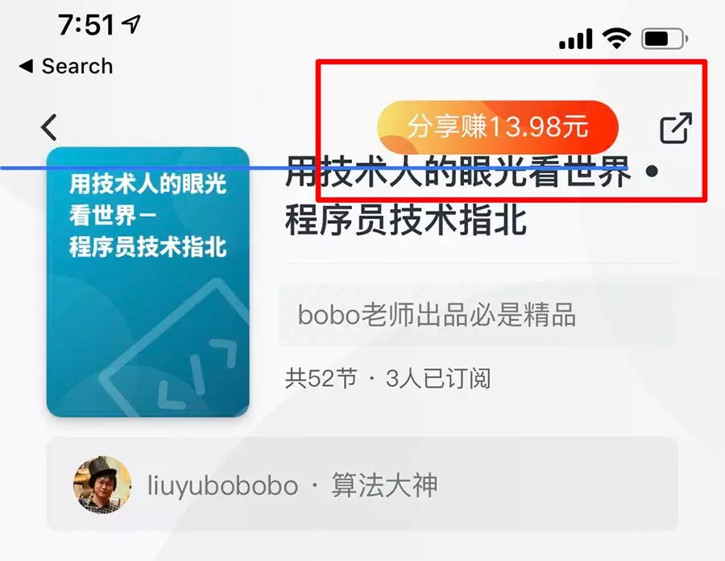
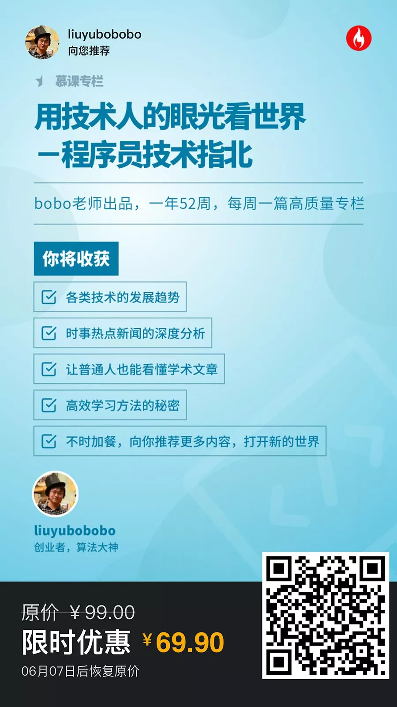

## 正式邀请你，和我一起，用技术人的眼光，探索世界

今天，我的新产品，在慕课网上线了：）

这个新产品是一个文字专栏，叫《用技术人的眼光看世界 · 程序员技术指北》。在这个专栏里，我没有聚焦在某一个具体技术上，而是打算使用一年的时间，每周更新一篇文章，一点一点陪你，一起，用技术人的眼光，看这个世界。

**以下，将是这个专栏的《开篇词》，我会描述我的创业经历：）**同时，这个专栏文字的试读，我挑选了6篇文章。这6篇文章，都选自我的公众号。老用户应该已经很熟悉这些文字了。但如果你不了解我的文字风格，可以通过这些试读文章，更多地了解这个专栏。

这个专栏的定价，现在购买，是69.9元，6月7日恢复原价后，是99元。所以，现在购买，平均下来，每篇文章，你将花费1.3元左右。**我有这个自信，让你为每篇文章付费的这1.3元，都物有所值。**

可能有些同学会问，有了这个专栏，这个公众号的文章怎么办？请大家放心。这个公众号还将继续运营。

**专栏的文字内容，由于是付费阅读，整体会更硬核一些；**

**而公众号的文字，探讨的话题，会更随意一些。**

但我向大家保证，从我手里发表出去的文字，一定都经过了我的仔细思考。硬核也好，随意也罢，只是话题角度的不同。但我会努力顾及每一篇文章的深度，让我的用户，能够通过我的每一篇文字，都有所收获。

希望大家能继续支持我：）

对了，专栏支持推荐分享赚佣金活动。每分享推荐成功一个用户，赚13.98元，可以直接体现。

---

### 《用技术人的眼光看世界 · 程序员技术指北》开篇词

大家好，我是liuyubobobo。是一名创业者，现旅居美国。研究生未毕业就开始创业，直到今天，已经将近15载了。同时，我也是资深的慕课网讲师。在慕课网的实战栏目中，已经有6门课程了，主要负责算法和数学方向。

2019年初，慕课网联系我，希望我能写一个专栏，用文字的方式，和大家分享更多技术知识。我毫不犹豫地答应了。但是，具体分享什么内容，我有一些不一样的想法。很多熟悉我的同学，可能会以为我一定会做一个算法技术相关的专栏，毕竟，讲解这些领域对我来说很是得心应手的。但是，思考再三，我决定不这样做。而是推出现在这个《用技术人的眼光看世界 · 程序员技术指北》。

可能，很多同学不明白，这是一个怎样的专栏。不要着急，这篇文章的最后，我会给大家解释清楚的。在这里，我想先给大家讲一讲，我创业时期的故事。

我前后有两次创业。第一次创业以失败告终；第二次创业，进展还不错，拿到了投资，到现在，也有稳定的现金流。我们的创业产品不是面向大众的产品，而是和北京大学光华管理学院合做，基于管理学教育的一个专属平台。是一个在极其垂直细分的领域内部的创业项目。所以，大家通过市面的途径，无法使用我们的产品，要更加详细理解我们的产品，其实是一个很专业的话题了，这和我们的这个专栏没有关系。不过，这次创业，让我深刻感受到了技术，和这个世界之间的复杂关系。

我创业初期，四处找投资。那时候，我参与了一次很奇特的饭局。饭局的主宾是一名投资人。那次饭局，投资人别出心裁，或许是想考考大家，又或者只是在饭桌上，不想聊那么严肃的问题，于是，让大家依次说一说，未来五年或者十年，世界会变成什么样子。这个饭局打开了我认知世界的另一扇门，因为，我突然发现，在座的各位创业者，即使80%都不是技术出身，对技术的理解，却比我这个科班专业的计算机学生更深刻。而且，他们普遍年龄，比我还小。

当然，他们不会Java和C++；不知道什么是复杂度分析；不懂逻辑回归和SVM；搞不好有的人都没接触过微积分。但是，他们知道某个行业发展的历史和现状；知道这个行业的局限性在哪里，也就知道发展的可能性在哪里，机会在哪里；他们知道技术有可能从哪个侧面，能改变这一切。因此，他们的创业项目大多有着明确的方向。虽然，他们的方向有可能是错误的，毕竟，谁也不能预测未来。但是，因为他们是有目的的行动，即使失败，他们也能更有针对性地从中吸取教训，或者及时调头，向着更好的方向前进。

相较而言，我虽然懂具体的技术知识，却只见树木，不见森林。别人告诉我，要实现这样一个功能，我能实现出来，却不明白，这个功能到底有没有意义，别人为什么需要这个功能，这一切背后是否有更深层次的原因。简单来说，我一直自以为是地在技术的小世界里畅游，却忽视了外面更大的世界。

好在，我研究生时的专业——虚拟现实，让我对VR，AR领域的前沿现状有一些了解，也能随便说上两句，不至于太尴尬。但是，那个饭局后，我就告诉自己，仅仅是技术好，是不够的。必须有更大的视野，必须看更大的世界。

---

由于我的第二次创业项目是和北京大学光华管理学院合做，所以，近乎整整五年，每个周末，我都是坐在北大的MBA或者EMBA课堂上度过的。在这个过程中，我也接触了很多来自各行各业的大佬朋友。他们有职业经理人，企业的中层管理者；也有创业者，企业的高管，甚至不乏身价上亿的老板。因为这个创业项目，我还有幸和万科集团合作；和王石先生一起吃饭，亲自来到云南哀牢山，采访了褚时健老先生。

这段时间，中国互联网飞速发展，新生事物层出不穷，新的企业也不断携着新的商业模式登台上场，为中国乃至是世界的技术史添加注脚。我们看到了越来越多的企业，正在使用技术，改造我们生活的方方面面。而与此同时，在北大的光华管理学院里，各行各业的大佬们探讨最多的话题，就是技术的发展趋势。大佬们最关心的，是技术如何和某一个具体行业融合。

此时的我，距离那次饭局，已经有两三年的光景了。这两三年的时间，我都在尝试，对我接触的每一个技术，不仅仅学习它的原理方法，还从一个更高的视角，去思考：这个技术为什么出现；它出现前，世界是怎样的；它解决了什么样的问题；现在，在这个技术的推动下，现状如何；局限性在哪里；改进的方向在哪里；未来又在哪里。

这样不停地思考，广泛地涉猎，是有回报的。在北大光华管理学院，逐渐和各个行业的大佬们交流的过程中，我发现自己对很多问题，有了属于自己的见解。这些见解不一定对，但是，在交流碰撞的过程中，大家互相取长补短，让我有了更大的收获。

有的大佬只是想通过互联网的方式销售自己的产品或者服务，但是，他们不明白，为什么淘宝这样一个看起来简单的网站，需要那么多人，用那么长时间维护；他们不知道怎么估计自己项目的预算和工期，也不知道怎么从零开始，创建一个网站；创建好一个网站，对企业的管理体系，又有着怎样的影响；

有的大佬希望自己的项目有新的增长点，想将诸如人工智能这样的技术运用到自己的行业中，但是，他们不知道怎么运用是合理的，可行的；可能的挑战又在哪里；他们不知道人工智能的商业化运用，前人已经有了怎样的尝试，又获得了怎样的经验教训；

有的大佬希望构建企业内部的知识管理系统，将企业的知识沉淀下来，而不仅仅是掌握在核心人物的手里。但是，他们不了解，知识管理有哪些工具，这些工具的优缺点是怎样的，哪一个适合自己的企业；

有的大佬想使用大数据，优化自己的企业发展，兴奋地跟我探讨每一个数据源可能的作用。这些数据源，甚至包括办公楼里抽水马桶抽水的频率和数量；

有的大佬，跟我探讨使用计算机技术分析海量法律文件资料的可行性；

还有的大佬，直接跟我探讨，有没有可能使用人工智能的方式，预测股票，或者金融市场的走势。

面对所有的这些问题，我都惊讶于，技术竟然已经如此无孔不入，深入地遍布在我们生活的方方面面。作为一个新时代的技术工作者，掌握具体的技术知识，固然是安身立命之本。但是，对技术发展有着全局性的认识和见解，将让你对整个世界拥有全新的认知。

在和行业大佬们的交流过程中，我又见识到了更大的世界，听到了很多人对同一个问题，不同角度的思考。这些思考汇集起来，进一步充实了我的认识，形成了一个正向循环。

---

后来，由于家庭原因，我先后旅居新加坡，美国两地。在海外，我不认识那么多商业大佬，平时对技术于商业发展上的探讨少了很多。但是，我却惊讶的发现，海外人才们普遍对世界发展趋势的关注。

即使不是技术工作者，不是创业者，大多数受过高等教育的民众，也会关注科技的发展可能给社会带来的问题。在如今的时代，隐私到底还是否存在，隐私的边界是否要被重新定义；区块链技术到底是不是下一代货币的革命性技术；人工智能的发展到底又意味着什么，能带给人类更多的便利，还是终将成为毁灭人类的技术；美国已经针对人工智能技术的具体应用，建立了新的法律，那么这一切，又将怎样改变技术的发展...

这些东西听起来好像很虚，离我们平时的工作生活很远，但你又不得不承认，这些东西和我们息息相关。他们反映了当今世界的走势。作为一名技术工作者，更多地把握世界的走势，就意味着更清醒的认识，更主动的选择权，以及更多的机会。程序员虽然自嘲自己是“码农”，但绝不能仅仅面朝黄土背朝天，每天只低头看着屏幕上的代码。我们必须能够不时地抬头，看一看这个世界。

于是，我决定推出这个专栏。**在这个专栏中，我们不讨论具体的技术知识，而是探讨：技术和这个世界的关系。技术，正在如何一点一点的，和我们所生活的世界交错，互相影响，互相改变。**这些改变的源头到底在哪里；现在正在怎样发展；未来将可能是怎样的。

所以，我管这个专栏叫《用技术人的眼光看世界》，我坚信，每一名技术人，由于有着扎实的技术功底，在面对如今这个技术无孔不入的世界时，能够多一分优势，能够更早地看懂世界的变化。

与此同时，我又加上了一个副标题——《程序员技术指北》。大家在攀登技术高峰时，都要在某一个技术栈上不断地学习精进，这个过程，叫做“指南”。然而，我的这个专栏，不是“指南”，而是指着相反的方向，在“指北”。我希望同学们平时钻研具体的技术，累了的时候，或者上下班通勤的途中，闲了的时候，翻开这个专栏的文章，是朝着相反的方向看了看。这就好像登山途中，大多数时候，我们都关注着脚下的山路，不断前行。但不时地，我们也要回头，向反方向望一望，看看高处的风景。我希望这个专栏的文章，能提供给你一些“反方向的风景”。

---

为了让大家更详细的了解这个专栏的风格，我为大家准备了六篇试读。这些试读文章，都是我的公众号《是不是很酷》中的文章。每一篇试读文章，都将从一个侧面，反映了这个专栏可能涉猎的内容。

 

**1. 各类技术的发展趋势**

首先，在专栏中，会有很多文章，分析某一个特定技术领域，甚至只是一个针尖大的技术点，相应的曾经和未来。比如这篇试读文章，探讨了编程语言的发展趋势和未来：

[**《编程语言的发展趋势：从没有分号，到DSL》**](../2019-03-25/)

甚至，在这个专栏中，你将会看到非计算机科学技术方面的文章。比如，生物医学和计算机科学的结合，在硅谷也是重要的趋势。所以，你也会在专栏中，看到类似这样的文章，探讨人类为了追求更长的寿命，所做出的各式各样的技术努力，以及未来。

[**《科技，死亡，和永生》**](../2019-04-05/)

 

**2. 时事热点新闻的深度分析**

每天，这个世界都产生着剧烈的变化。这些变化，很多都和计算机科学有着密切的关系。针对重大的实时热点新闻，我也会在这个专栏，发表一些深度解读。在这里，同学们大可放心，我的文章，绝不会仅仅是叙述一遍事实而已，肯定会向大家尽可能地奉献“干货”，提供有深度的视角和思考。比如这篇试读，我试着解读，新西兰恐袭事件背后，科技在扮演着怎样的角色：

[**《新西兰恐袭，疯狂删帖的小编，背锅的算法工程师，以及“技术优越主义”》**](../2019-03-21/)

我公众号中的另一篇文章，则从巴黎圣母院的大火，谈到IT世界的兴衰。

[**从巴黎圣母院的大火，到消逝的IT巨头**](../2019-04-18/)

 

**3. 让普通人也能看懂学术文章**

学术界也是推动当今社会发展的一股重要力量。很多新兴的技术，都是先从学术界诞生，之后慢慢走向业界，最终商用化的。在这个专栏中，我也会不时选取我认为有意义的论文，或者论文系列，以科普的方式，向大家介绍，让不在学术界的你，用一种更加浅显的方式，了解学术界的前沿思考。比如在下面这篇试读中，我将以美国著名教育学家Dweck对聪明的研究为主线，向大家介绍她的一系列论文观点，同时，希望大家也能从中，找到更多努力的动力。

[**《天生不聪明》**](../../2018/2018-07-18/)

 

**4. 高效学习的秘密**

在如今这个知识爆炸的时代，每一个同学，都面临着持续学习，终身学习的问题。到底怎样学习才是高效的？在这个专栏中，你也将会不时地看到一些学习方法论的文章，探讨学习的秘密。比如以下两篇试读：

[**《高效学习的秘密》**](../../2018/2018-04-18/)

[**《知识掌握的七个境界》**](../2019-04-11/)

 

**5. 不时加餐，向你推荐更多内容，打开新的世界**

当然了，在这个专栏中，我还将会不时地给你加餐，可能会向你推荐一些好的书籍；可能会邀请你看一部好的电影。不要误会，我不是一个文艺青年，顶多是一个伪文艺青年。我的推荐一定都和技术有关。但在这个时代，技术本身，也已经深度和艺术结合在了一起。我相信，我推荐的作品，一定能够拓宽你的技术视野，更好地，从一个技术人的角度，看待这个世界的。

 

那么，还等什么？现在，就让我们一起，花一年时间，一点一点，用技术人的视角，看这个世界。

欢迎加入《用技术人的眼光看世界 · 程序员技术指北》。

**我是liuyubobobo：）**

---

对了，现在推荐你的朋友加入这个专栏，还能赚佣金。每一份成功推荐，赚13.98元。直接提现。

怎么加入？以下这个二维码，就是我的分享赚佣金的海报。

当然，你可以不使用，而是直接去慕课网的官网或者app中，直接购买。在首页，只要点击专栏，第一个映入眼帘的，就是我的新产品：）

 

谢谢大家支持：）

新的一天，大家加油！
