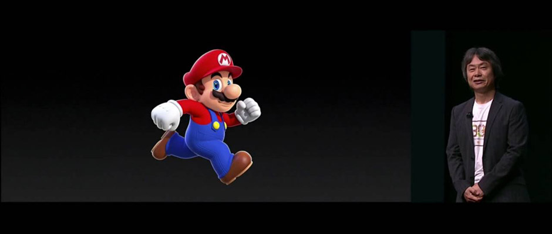

## 答读者问 | 这个年代，还有必要学英语吗？要说没必要，也没毛病

上一周，我的专栏更新《学英语的最佳年龄到底是什么时候？》，谈了谈英语学习的相关话题。为了配合专栏的更新，我上一周的推文《看美剧学英语靠不靠谱？我说靠谱，方法都在这里了》也是聊英语学习方法的。

于是，有一个同学给我发来了这样一个问题：

> 现在翻译工具这么多，翻译工具翻译的越来越准确，程序猿还有必要学习英语吗？比如我学react，也经常上官网看一些api，大部分情况下都是用谷歌翻译，基本上都能知道大体意思；再比如react发布了新特性，上面有一段视频是介绍react hooks的特性，虽然95%以上我不知道那小哥在讲什么，但是我能看懂他写的代码。所以，在当下，学习英语真的很有必要吗？

估计很多同学看到这个问题，会猜这篇推文我要侃侃而谈英语学习的必要性了。不过，我想我的回答会让很多同学大跌眼镜。

虽然我认为英语确实很重要；从我尚不长的人生经验看，我坚信我还不算太差的英语，能够让我相对无碍地直接查看英文资料，也帮助了我很多很多，甚至在几个我经历的关键节点，说改变了我的人生都不为过。

但是，面对这个问题，我的回答却是：**如果你真心认为没必要学，那么就没必要学。**

---

**bobo老师的回答：**

大家年龄进入了成年，脱离了基础教育体系之后，进行自学，我比较尊崇这样一个观点：**如果你觉得没必要学习，同时自己也没有兴趣，那就不需要去学。**

换句话说，我认为如果你选择学习一个技能，应该是因为：

**1. 或者你觉得这个技能有用。**

比如有一些同学学习编程，可能只是觉得编程有用而已。其实他们可能并不是那么喜欢编程，但编程能找到一份工资还不错的工作，那就学呗。毕竟，干什么都要学，为什么不学一个热门的，获得高工资的概率更大的技能呢？这个想法一点儿毛病都没有。

**2. 或者你对这个技能感兴趣。**

据我所知，很多同学学习英语，并不是因为英语对他的工作多有用，而是因为感兴趣，觉得能看懂《冰与火之歌》的原版，或者没有字幕看美剧，或者到国外和老外侃侃而谈，是件很酷的事情，所以开始学英语。至于英语进步以后，意外获得了一些更好的工作机会，完全是计划之外的，自己都没有想到的事情。

很多同学学习绘画，学习吉他，也是因为兴趣，绝不是要从事艺术行业的工作。

甚至我知道一些同学学习算法，都是因为兴趣。并不是自己的工作对算法的要求有多高，也不是自己想怎么靠着算法水平去升职加薪。有些同学只是想了解，那些烧脑的算法问题，背后的解决逻辑是怎样的，而已。

---

**如果，对于一个技能，你认为既没有用，又没有兴趣，那我个人就建议，没必要学习。**

不用纠结一个技能有没有用。这个问题没有意义。因为所有的技能，出现在了这个世界上，就一定是有用的。**问题的关键是，这个技能对你有没有用。**

如果你的问题是不知道它有什么用，别人还可以告诉你，这个技能能做这个，能干那个；

但是如果像这个提问的同学一样，已经很明确的感知到英语这个技能，毫无作用，那么事实很可能就是这样的：现阶段而言，英语对你就是没有用。如果已经有了这么清晰的判断，我个人的建议就是：不要学。

原因很简单，在这种情况下，学习效率实在太低了。大家都是成年人，已经有了充足的自我选择的空间和自由，完全没有必要再像基础教育的时候一样，被别人逼着去学习了。别人逼着学，谁都不开心，好不容易长大了，为什么不开开心心做自己喜欢的事儿？

比如数学，很多同学就觉得没用，工作的时候也用不到。那在我看来，就没必要去学。什么时候突然发现：有些机会，自己抓不到，但是别人能抓到，是因为那些人的数学比自己好的时候，再去学。学起来自然有目标，有动力，效果会很显著。

再比如算法，很多同学也觉得没用。所以我干脆写了一篇文章，叫[《学算法有什么用，可能真没用》](../2019-03-18/)。也是这个意思。作为一个教算法的老师，天天喊大家可能不用学算法，也是没谁了。慕课网都拿我很无奈。

你说算法决定了一个计算机工作者的基础素养和技术上限，我同意。但我确实看到了很多大牛，也在互联网行业摸爬滚打，混得风生水起，可是算法真的不怎么样。我说的是大实话。感兴趣的同学可以再看看那篇文章。

对于很多同学而言，算法的核心作用可能就是应付面试。那就学到能应付面试为止就好了。面试算法真的不难。目标明确的话，学起来也很有动力，效率也很高。等什么时候，你发现限制自己技术的天花板是算法的时候，再去好好学算法。学起来自然有目标，有动力，效果会很显著。

又比如英语，在我看来也是这样的。这名同学的提问有问题吗？我觉得没有任何问题的。虽然我认为英语很重要，而且我看到的事实是，在统计意义上，英语越好的同学，机会越多，但是这不代表要想走向成功，英语必须好。讲真，英语不怎么样，做得很成功的人，一抓一大把。

我印象最深的，就是2016年的苹果发布会，请到了超级玛丽的设计者宫本茂。宫本茂说的那两句英文，显然是事先准备好的。但就是准备好的这两句，他说的那个蹩脚程度，看他的表情，我自己都替他觉得尴尬。

但那又怎样呢？人家是享誉全球的大IP超级玛丽之父啊！当他用蹩脚的英语宣布超级玛丽将会上架 App Store 的时候，会场上爆发出了在我看来是那场发布会最热烈的欢呼。任天堂的股价当天直飙18.79%。

我在互联网上没有看到任何一个人讨论宫本茂大神的英语问题。

那么，学英语是必须吗？必须不是啊！

---

所以，问题又回到了我在[《学算法有什么用，可能真没用》](../2019-03-08/)一文中最后的观点：一个东西是不是没有用，这不是一个核心的问题。核心的问题是：对于每个人来说，我们能不能理清对自己来说，有用的是什么？当下自己学习什么，受益最大，效益最高？或者自己最感兴趣，所以学习速度可能最快，获得的成就可能最卓越？这才是最最最重要的问题。

一旦想明白了对于自己来说，什么东西最有必要学，就一股脑地去学好了。学的过程中，大家可能会发现需要其他领域的知识支撑，再去补就好了。效果最好，效率最高。甚至不去补，想办法绕过它，就像这名同学说的，谷歌翻译挺好的啊，对于我的需求，足够了啊。那就ok。继续向着自己的目标去。

其实，真的没有那么多人去关注你不会什么，没学什么；**在社会上，大家普遍更关注的是：你会什么，学了什么，做了什么。**

不要在意别人的目光。

不要认为所有人都觉得该会的东西你一定要会，比如英语和数学；

也不要认为所有人都觉得该有的东西你一定要有，比如房子和车子。

关键是想清楚自己想要什么。如果能想清楚这个问题，即使最后得出的结论和大多数人是一样的，在我看来，也是酷酷的。因为，你有属于你自己的思考。

**在我看来，“酷”从不代表着和别人不一样。因为“酷”本身，和别人一点儿关系都没有。“酷”的来源，是对自己的深刻了解。**

当然了，我也必须要说，对于很多同学，可能还想不清楚自己要什么，可能还在探索自己的方向，这也很正常。在这种情况下，如果问我，从事计算机行业，建议学什么？**我给的建议是：学好计算机的基础知识（算法，数据结构，操作系统，等等等等）和英语。**因为以我的认知，这二者是最通用的，能最大概率让大家脱颖而出，或者带给大家新机会的技术。

**大家加油！：）**