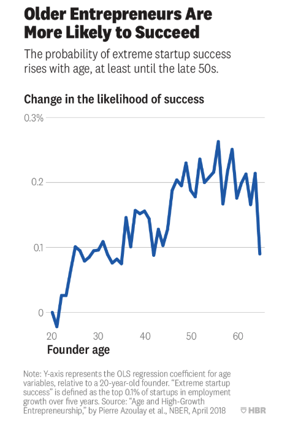

## 罗振宇和“乌鸦嘴”

**1.**

最近，罗振宇被骂了。

被骂的原因，说白了，是因为不靠谱。

2014 年，在北京大火的黄太吉，得到了罗振宇的加持。他说，黄太吉的成功，意味着过去商业世界所有观察角度全错。甚至一度，很多白领都在探讨，是不是去卖煎饼果子，才是通往财富自由的正确方式。

结果，2016 年，黄太吉陆续关店。很多白领梦碎。

2015 年 12 月 31 日，罗振宇第一次跨年演讲，他公开表示，乐视和暴风影音这样的公司，不能用传统的眼光看待，这是一个新物种，一定会改变我们的环境。

结果大家也看到了，贾老板欠债高达 70 个亿，现在还躲在美国不敢回国；至于冯鑫，也已经被采取强制措施。这里面，盘子太大，水太深，咱也不知道，咱也不敢问。不管怎样，他们都是失败的，真要说改变了我们的环境，也是向着坏的方向。

2016 年，罗振宇又公开表示看好罗永浩。彼时，罗永浩发布了锤子手机 M1。但与此同时，锤子手机正在以每年 4 亿人民币的速度亏损，财务问题从锤子科技诞生的那一刻起，就一直萦绕在这家网红企业上空。

2019 年 3 月，罗永浩不再担任锤子软件（北京）有限公司法人代表。

至于 ofo，说实话，罗振宇并没有在 ofo 失败前表示极度看好小黄车，只是认为戴维虽然当前深陷困境，但还年轻，未来还有很多可能。

对此，我是非常认同的，不能算是罗振宇的“乌鸦嘴”，真要算，是无良自媒体强行凑黑材料，带节奏。

 

**2.**

就算抛去 ofo 不看，黄太吉，乐视，暴风影音，锤子科技，这么多证据，似乎也能说明罗振宇的“乌鸦嘴”了。

但对此，其实我是不太同意的。照我看，罗振宇只是“单纯得可爱”而已。

我曾经写过一篇文章，[《网购有助"脱单"?我还实现了一个准确率99.9%的癌症预测系统呢》](../../2017/2017-09-02/)，讲的是机器学习或者统计学领域的一个很朴素的思想。

假设，有一种疾病，发病率是千分之一，即 0.1%，那么，我可以利用这个事实，不作任何事情，就发明出一个准确率高达 99.9% 的疾病预测系统。

怎么做？很简单，对于任何一个人，我都无差别地预测：这个人是健康的。反正只有 0.1% 的人会得病，对这 0.1% 的人，我的预测是错误的；但是，对剩下的 99.9% 的人，我的预测都是正确的。整体看来，我的预测准确率高达 99.9%。虽然没有任何技术含量。

这种情况，被称为数据极度倾斜（Extremely Skewed Distribution）。患病人群相比健康人群，少太多了。所以，“准确率”这个常用的指标，不再能反映出真实的问题。在统计学或者机器学习领域，会使用其他指标，来鉴别出，这样的预测，其实是无意义的。

具体技术细节，在这里不探讨了，也不是这篇文章的重点。

但是，这种数据极度倾斜的情况，在生活中，其实也很常见。

创业就是如此。

对于创业来说，失败的概率，是远远大于成功的概率的。大概是多少呢？我之前写的文章[《成功者的年龄》](../2019-07-31/)中，引用了哈佛商业评论的一个数据：不管创始人的年龄是怎样的，创业成功率都稳稳地在千分之三以下。

在这样的一个概率分布下，很显然，**去看衰你所知道的任何一个企业，才是当“先知”的最佳策略。**

 

**3.**

其实，这样的例子，在生活中随处可见。

算命是另外一个很好的例子。

大多数算命先生，肯定要说你将要遇到一点儿小挫折，小磨难，而绝对不会说你一帆风顺。

除了因为人家要靠消灾解难赚钱以外，还有一个重要的原因：这么说，是近乎百分百不会错的。

所谓人生不如意，十有八九。

我们身边很多人，也会有意无意地运用这套逻辑。具体表现就是，不管你做什么，他们都不看好，觉得八成做不成。

如果你真的没做成，他们会洋洋得意地表示，你看你看，我早就跟你说了吧，这事儿有问题的；

但倘若你做成了，他们会开心地表示，之前只是善意地提醒，能成功，我也很开心啊。

怎么都不得罪人。

 

看衰一个企业同理，煞有介事地表现出对一个企业的担心，指出运营模式的问题，其实是十拿九稳的方式。

事实上，在现实世界中，大多数人也是这么做的。

苹果自打乔布斯时代，依靠 ipod, iphone 等产品一路逆袭，也一路伴随着众多质疑声。随着乔布斯“驾崩”，库克“上位”，苹果药丸的声音更是没有断过。

苹果的市值，也伴随着这些质疑声，慢慢超越了谷歌脸书等巨头，甚至一度排名世界第一。

尽管如此，如果大家去翻翻媒体报道，最多的声音依然还是苹果药丸。

为什么？

因为大家都知道，苹果早晚药丸。

 

**4.**

在商业界，有一个共识，就是**企业法人的寿命，是远远小于自然人的寿命的。**

说白了，就是没有什么企业能活 100 岁，哪怕你是现在的巨头。看看雅虎，柯达，就明白了。

如果觉得这些企业的例子离我们太远，那就看看黄太吉，乐视，暴风影音和 ofo 吧。去翻翻三五年前的新闻，感受一下那时候的媒体报道，然后，再看看今天。

我在[《从巴黎圣母院的大火，到消逝的IT巨头》](../2019-04-18/)一文中，引过 BBC 的数据。BBC 在 2012 年，曾发表过一篇振聋发聩的文章，叫《Can a company live forever?》（一家公司可能永远活着吗？）其中的统计数据表示，现如今，美国标普 500 指数的公司，平均寿命竟然只有 15 年。

换句话说，15 年后，大部分现在耳熟能详的大企业，都会被新的公司替换掉。

中国呢？我能查到的数据是，中小企业的平均寿命仅 2.9 年，中国集团企业的平均寿命仅 7-8 年。

这个数据不一定准确，毕竟，我国在数据统计方面，还不够完善。但是，趋势是毋庸置疑的：大多数企业的寿命，其实是很短的。

所以，大家经常能看到新闻，什么硅谷神童，七八岁的样子，收到了苹果谷歌微软的 Offer，让小朋友长大以后来工作。小朋友们笑着表示，不要不要不要，我长大以后要自己做企业。

可不是嘛。先不说打工和创业的区别，关键是，等小朋友长大了，苹果谷歌微软，指不定什么样子了呢。

 

**5.**

所以，在大多数情况下，大多数人其实是悲观的。

用这样的视角看，罗振宇这个也看好，那个也看好，结果看好的都黄了，真的是“单纯得可爱”。

之所以给“单纯得可爱”加引号，是因为，商业的世界里，难免有各种利益纠葛。到底怎么回事儿，里面的人可能都说不清，更不要提外面的人了。

如果这里没有什么利益关系，**我倒是真的很欣赏罗振宇这个“敢夸”的性格。**

但是现在媒体这么一闹，不知道罗振宇先生会不会不再这么“单纯”了。

 

至于“乌鸦嘴”，其实有很多文学作品和科学研究，都在为乌鸦正名。

不好的事情发生了，却怪罪乌鸦，这实在不能称为理性。

不过，并不是所有人都追求理性。

 

值得一提的是，科学研究表明，乌鸦的智商，其实是极其高的。

人类大脑，约占自身总体重的 1.5%，普通渡鸦则约为 1.3％，有一种短嘴鸦，大脑重量，竟能占总体重的 2.3％。

但人们依然说乌鸦不吉利。

毕竟，**把问题归咎于一种长相丑陋，叫声难听的鸟，比实际去分析清楚问题的真正原因，要简单太多。**
